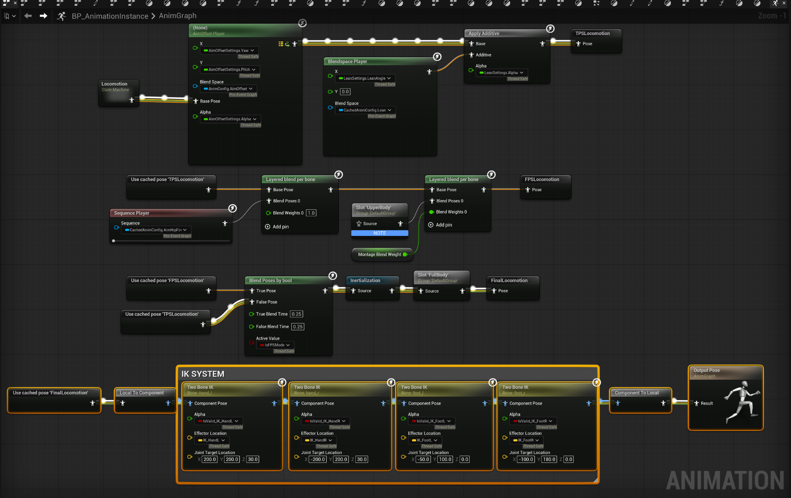
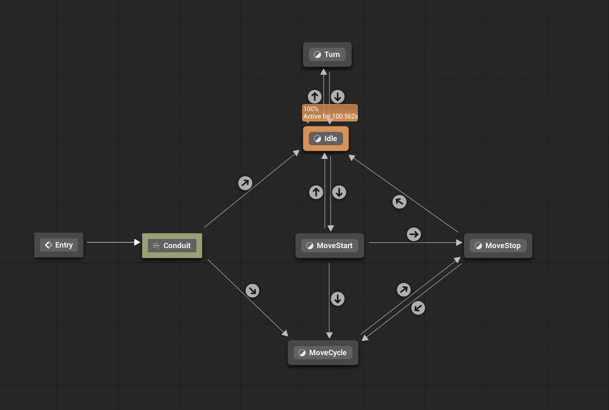
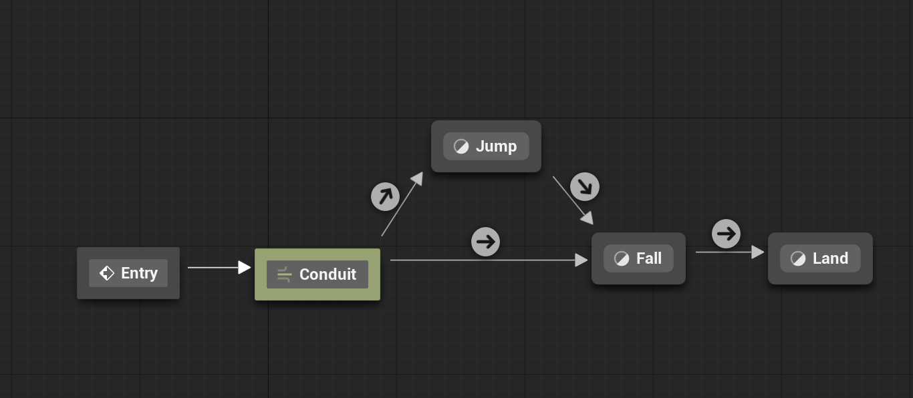
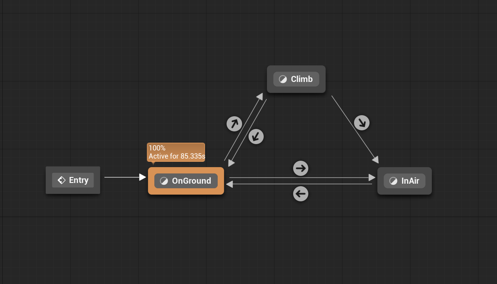

# Unreal Engine C++ Locomotion & Climbing System

## Overview

A C++-driven locomotion system in Unreal Engine, focused on **gameplay–animation separation**, **custom movement logic**, and **multiplayer-aware behavior**.

---

## Features

* **System-driven animation**
  Animation is driven by gameplay state (movement, direction, aim offset, lean, pivot), not Blueprint-only logic

* **Multi-mode locomotion**
  Supports FPS, TPS, and climbing with shared architecture and mode-specific behavior

* **Custom climbing movement**
  Implemented via `CharacterMovementComponent::PhysCustom`, including surface alignment, root motion climb-up, and ledge detection

* **Client-predicted movement model**
  Autonomous proxy and server execute the same logic, while simulated proxies follow replicated state

* **Climb IK**
  Trace-based hand and foot placement with smoothing

* **Data-driven animation**
  Animation assets configured via DataAssets for flexibility and reuse

---

## Architecture

```text
Input → Character → MovementComponent → ClimbComponent → AnimInstance
```
## Visual Overview

### Animation Graph (System Data Flow)
Core animation pipeline with layered blending, aim offset, montage integration, and IK system.



---

### Movement State Machine (High-Level)
Top-level movement states including Ground, Air, and Climb.



---

### Jump / Air State
Jump → Fall → Land transition flow.



---

### Locomotion State Machine (Detailed)
Idle, MoveStart, MoveCycle, MoveStop, and Turn transitions.


---

