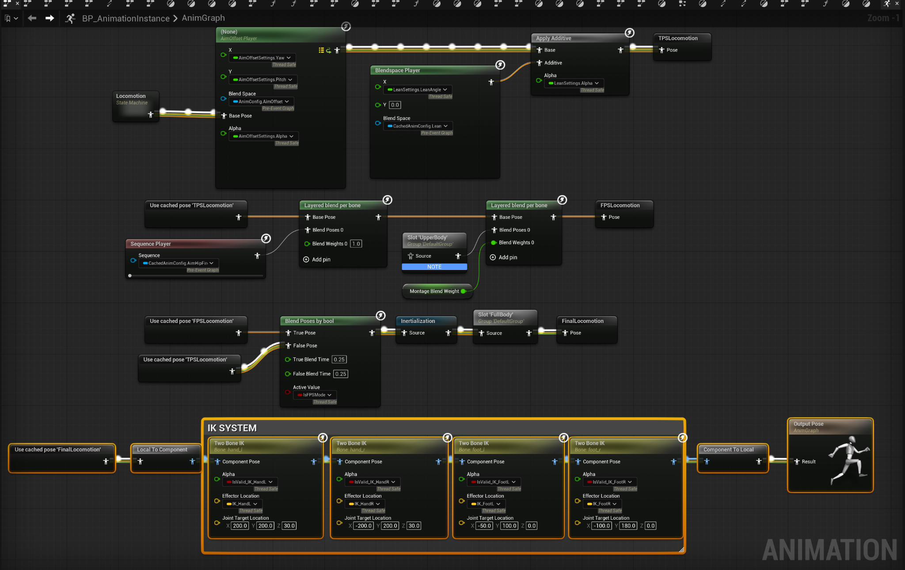
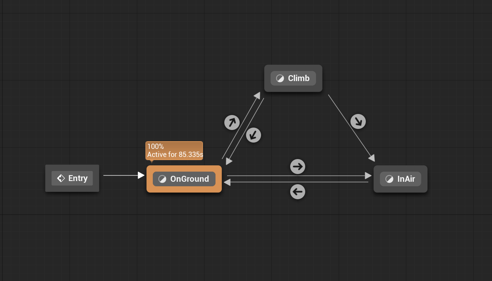
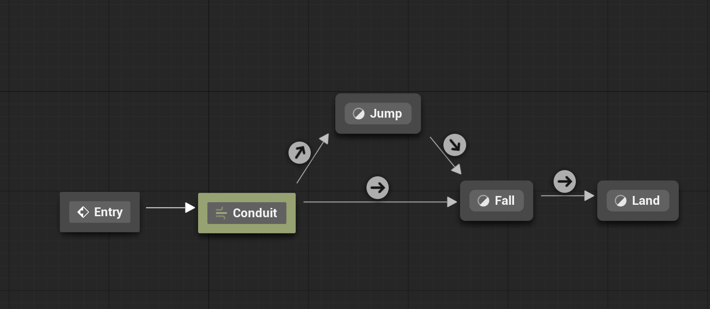
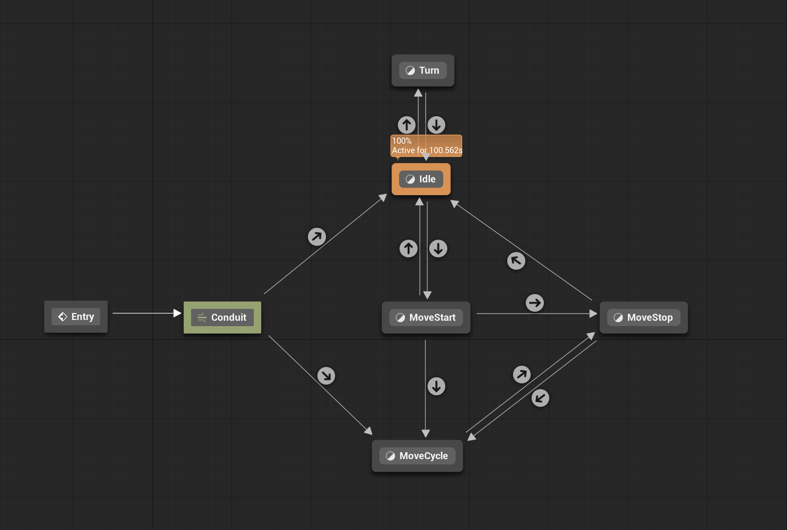

# Unreal Engine C++ Locomotion & Climbing System

## Overview

A C++-driven locomotion system in Unreal Engine, focused on **gameplay–animation separation**, **custom movement logic**, and **multiplayer-aware behavior**.

## 🎥 System play Video

[](https://www.youtube.com/watch?v=6jFna2a2Zhc)

---
# Unreal Engine C++ Multiplayer Locomotion & Climbing System

A C++-driven character movement system built around Unreal Engine's Character Movement framework, focused on gameplay–animation separation and multiplayer-compatible custom movement.

**The project addresses several practical engineering problems common to networked character systems**:

- Keeping gameplay and movement state as the source of truth instead of embedding gameplay decisions inside Animation Blueprints.
- Extending Unreal's movement framework with custom climbing while preserving its multiplayer movement model.
- Organizing locomotion, climbing, FPS/TPS presentation, and IK without coupling them into a monolithic animation system.

## Key Design Decisions

**Gameplay-driven animation**  
Gameplay and movement state drive the animation layer, keeping movement decisions separate from presentation.

**Climbing integrated with Character Movement**  
Climbing uses `CharacterMovementComponent::PhysCustom`, keeping custom movement inside Unreal's existing movement and networking architecture.

**Layered animation architecture**  
Ground movement, airborne states, climbing, FPS/TPS presentation, montages, aim offset, and IK are organized as separate states and layers.

## Features

- FPS / TPS locomotion
- Client-predicted multiplayer movement
- Custom climbing and ledge detection
- Root-motion climb-up
- Hand and foot IK
- Aim offset, lean, pivot and turn-in-place
- Data-driven animation configuration
---

## Architecture

```text
Input → Character → MovementComponent → ClimbComponent → AnimInstance
```
## Visual Overview

### Animation Graph (System Data Flow)
Core animation pipeline with layered blending, aim offset, montage integration, and IK system.



---

### Movement State Machine (High-Level)
Top-level movement states including Ground, Air, and Climb.



---

### Jump / Air State
Jump → Fall → Land transition flow.



---

### Locomotion State Machine (Detailed)
Idle, MoveStart, MoveCycle, MoveStop, and Turn transitions.


---

